<h1 align="center">Hello 👋, I'm Pascal</h1>

<h3 align="center">I’m interested in all around DevOps, automation, cloud and how to do amazing things with Kubernetes.</h3>

- 🔭 I’m currently working on **improving my Go skills** and becoming an even better Devops Engineer 😎. Also I'm working on a new thing.

- I created a new blog, where I write about cloud, Kubernetes, automation and more. Find it [here](https://www.cloudmeier.com).

- 📝 I regularly write articles on [https://pgrunm.github.io/](https://pgrunm.github.io/)

- 💬 Ask me about **Go, cloud things and automation.**

- 📫 How to reach me **https://mailhide.io/e/kQhcqCgM**

<h3 align="left">Connect with me:</h3>

<h3 align="left">Languages and Tools:</h3>

 
     
     
     
     
     
     
     
     
     
     
     
     
     
     
     
     
     

